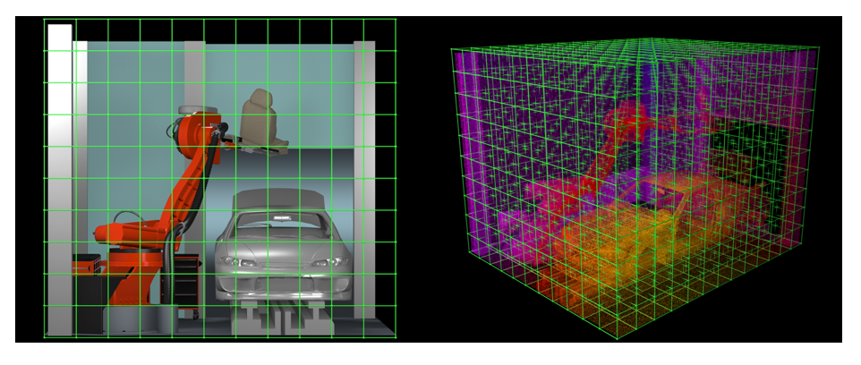
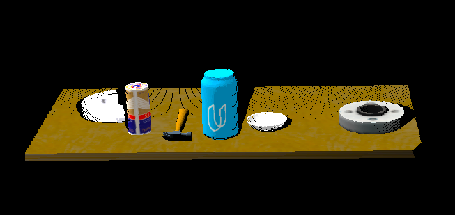
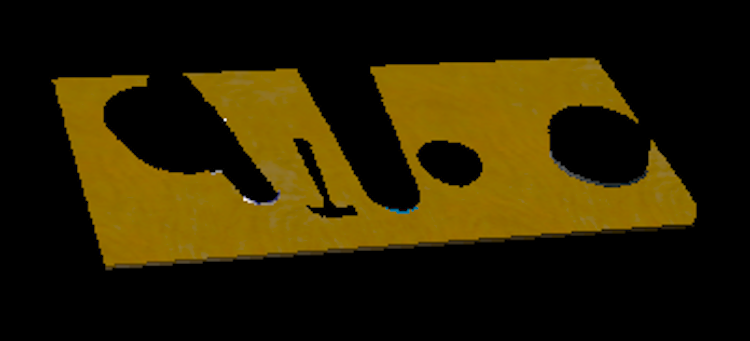
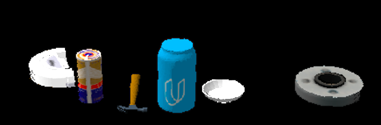
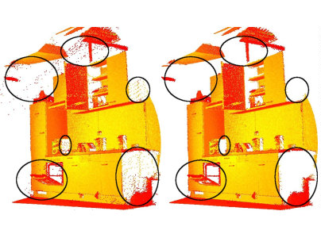
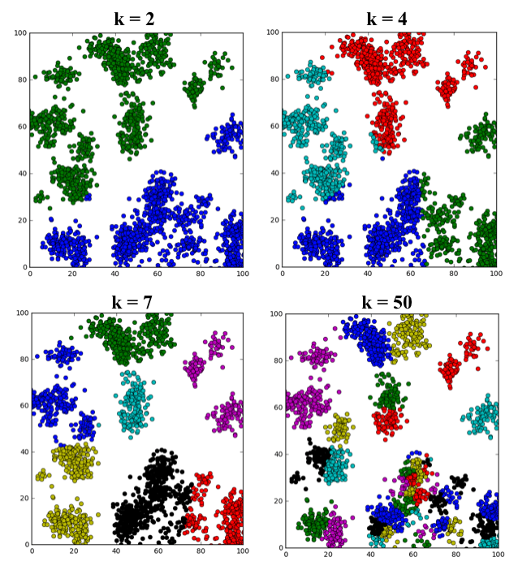
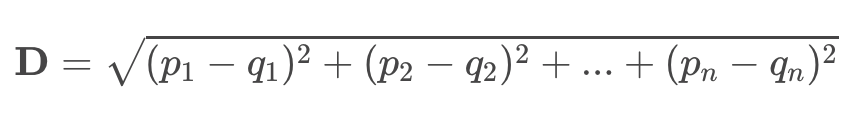
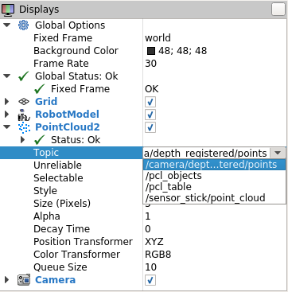

[](https://www.udacity.com/robotics)

# A.  Create a Catkin workspace

1. Download the VM provided by Udacity

2. Create a top level catkin workspace directory and a sub-directory named `src`
```
mkdir -p ~/catkin_ws/src
```
3. Navigate to the `src`
```
cd ~/catkin_ws/src
```
4. Initialize the catkin Workspace
```
catkin_init_workspace
```

5. Return to the top level directory
```
cd ~/catkin_ws
```
6.  Build the Workspace
```
catkin_make
```
For more information on the catkin build, go to [ROS wiki](http://wiki.ros.org/catkin/conceptual_overview)


# B. 3D Perception
Before starting any work on this project, please complete all steps for [Exercise 1, 2 and 3](https://github.com/udacity/RoboND-Perception-Exercises). At the end of Exercise-3 you have a pipeline that can identify points that belong to a specific object.

In this project, you must assimilate your work from previous exercises to successfully complete a tabletop pick and place operation using PR2.

The PR2 has been outfitted with an RGB-D sensor much like the one you used in previous exercises. This sensor however is a bit noisy, much like real sensors.

Given the cluttered tabletop scenario, you must implement a perception pipeline using your work from Exercises 1,2 and 3 to identify target objects from a so-called “Pick-List” in that particular order, pick up those objects and place them in corresponding dropboxes.

# C. Project Setup
For this setup, catkin_ws is the name of active ROS Workspace, if your workspace name is different, change the commands accordingly
If you do not have an active ROS workspace, you can create one by:

```sh
$ mkdir -p ~/catkin_ws/src
$ cd ~/catkin_ws/
$ catkin_make
```

Now that you have a workspace, clone or download this repo into the src directory of your workspace:
```sh
$ cd ~/catkin_ws/src
$ git clone https://github.com/udacity/RoboND-Perception-Project.git
```

Now install missing dependencies using rosdep install:
```sh
$ cd ~/catkin_ws
$ rosdep install --from-paths src --ignore-src --rosdistro=kinetic -y
```
Build the project:
```sh
$ cd ~/catkin_ws
$ catkin_make
```
Add following to your .bashrc file
```
export GAZEBO_MODEL_PATH=~/catkin_ws/src/RoboND-Perception-Project/pr2_robot/models:$GAZEBO_MODEL_PATH
```

If you haven’t already, following line can be added to your .bashrc to auto-source all new terminals
```
source ~/catkin_ws/devel/setup.bash
```

To run the demo:
```sh
$ cd ~/catkin_ws/src/RoboND-Perception-Project/pr2_robot/scripts
$ chmod u+x pr2_safe_spawner.sh
$ ./pr2_safe_spawner.sh
```


Once Gazebo is up and running, make sure you see following in the gazebo world:
- Robot

- Table arrangement

- Three target objects on the table

- Dropboxes on either sides of the robot


If any of these items are missing, please report as an issue on [the waffle board](https://waffle.io/udacity/robotics-nanodegree-issues).

In your RViz window, you should see the robot and a partial collision map displayed:


Proceed through the demo by pressing the ‘Next’ button on the RViz window when a prompt appears in your active terminal

The demo ends when the robot has successfully picked and placed all objects into respective dropboxes (though sometimes the robot gets excited and throws objects across the room!)

Close all active terminal windows using **ctrl+c** before restarting the demo.

You can launch the project scenario like this:
```sh
$ roslaunch pr2_robot pick_place_project.launch
```
# Code Analysis
### Calibration pattern (OpenCV) (Lesson 20.3-Lesson 20.7)
Use OpenCV tools on how 3D points in the world get mapped down onto the 2D image plane in the camera.  Some interesting functions to use are [cv2.findChessboardCorners()](http://docs.opencv.org/2.4/modules/calib3d/doc/camera_calibration_and_3d_reconstruction.html#cv2.findChessboardCorners) and [cv2.drawChessboardCorners()](http://docs.opencv.org/2.4/modules/calib3d/doc/camera_calibration_and_3d_reconstruction.html#cv2.drawChessboardCorners)

Sample Code:
```
import numpy as np
import cv2
import matplotlib.pyplot as plt
import matplotlib.image as mpimg
import glob

# prepare object points
nx = 8  #TODO: enter the number of inside corners in x
ny = 6  #TODO: enter the number of inside corners in y

# Make a list of calibration images
images = glob.glob('./Cal*.jpg')
# Select any index to grab an image from the list
idx = -1
# Read in the image
img = mpimg.imread(images[idx])

# Convert to grayscale
gray = cv2.cvtColor(img, cv2.COLOR_RGB2GRAY)

# Find the chessboard corners
ret, corners = cv2.findChessboardCorners(gray, (nx, ny), None)

# If found, draw corners
if ret == True:
    # Draw and display the corners
    cv2.drawChessboardCorners(img, (nx, ny), corners, ret)
    plt.imshow(img)
```

### Point Cloud Filtering (Lesson 20.8 - Lesson )
#### VoxelGrid Downsampling Filtering (Lesson 20.10)
RGB-D cameras provide feature rich and particularly dense point clouds, meaning, more points are packed in per unit volume than, for example, a Lidar point cloud. Running computation on a full resolution point cloud can be slow and may not yield any improvement on results obtained using a more sparsely sampled point cloud.

So, in many cases, it is advantageous to downsample the data. In particular, you are going to use a VoxelGrid Downsampling Filter to derive a point cloud that has fewer points but should still do a good job of representing the input point cloud as a whole.



PCL provides a handy function to perform VoxelGrid downsampling. Add the following code to the Voxel Grid Downsampling section of `RANSAC.py`.

```
# Create a VoxelGrid filter object for our input point cloud
vox = cloud.make_voxel_grid_filter()

# Choose a voxel (also known as leaf) size
# Note: this (1) is a poor choice of leaf size   
# Experiment and find the appropriate size!
LEAF_SIZE = 1   

# Set the voxel (or leaf) size  
vox.set_leaf_size(LEAF_SIZE, LEAF_SIZE, LEAF_SIZE)

# Call the filter function to obtain the resultant downsampled point cloud
cloud_filtered = vox.filter()
filename = 'voxel_downsampled.pcd'
pcl.save(cloud_filtered, filename)
```

Now you can run the file using Python and view the result using the `pcl_viewer`

```
$ python RANSAC.py
$ pcl_viewer voxel_downsampled.pcd
```
#### ExtractIndices Filtering
#### PassThrough Filtering (Lesson 20.11)
The Pass Through Filter works much like a cropping tool, which allows you to crop any given 3D point cloud by specifying an axis with cut-off values along that axis. The region you allow to pass through, is often referred to as region of interest.

To accomplish this task, add the following code to your RANSAC.py file in the Pass Through Filter section to select a region of interest from your Voxel Downsample Filtered point cloud.



```
# PassThrough filter
# Create a PassThrough filter object.
passthrough = cloud_filtered.make_passthrough_filter()

# Assign axis and range to the passthrough filter object.
filter_axis = 'z'
passthrough.set_filter_field_name(filter_axis)
axis_min = 0.6
axis_max = 1.1
passthrough.set_filter_limits(axis_min, axis_max)

# Finally use the filter function to obtain the resultant point cloud.
cloud_filtered = passthrough.filter()
filename = 'pass_through_filtered.pcd'
pcl.save(cloud_filtered, filename)
```
#### RANSAC Plane Fitting (Lesson 20.14)

The RANSAC algorithm mainly involves performing two iteratively repeated steps on a given data set: Hypothesis and Verification. First, a hypothetical shape of the desired model is generated by randomly selecting a minimal subset of n-points and estimating the corresponding shape-model parameters.



Thankfully, you don't need to implement RANSAC plane fitting yourself because the algorithm already exists in the PCL library! To implement RANSAC plane fitting in your code for this exercise, add the following code to the RANSAC plane segmentation section of your RANSAC.py file:

```
# Create the segmentation object
seg = cloud_filtered.make_segmenter()

# Set the model you wish to fit
seg.set_model_type(pcl.SACMODEL_PLANE)
seg.set_method_type(pcl.SAC_RANSAC)

# Max distance for a point to be considered fitting the model
# Experiment with different values for max_distance
# for segmenting the table
max_distance = 1
seg.set_distance_threshold(max_distance)

# Call the segment function to obtain set of inlier indices and model coefficients
inliers, coefficients = seg.segment()
```

#### Extracting indices (Lesson 20.15)
As the name suggests, the ExtractIndices Filter allows you to extract points from a point cloud by providing a list of indices. With the RANSAC fitting you just performed, the output inliers corresponds to the point cloud indices that were within max_distance of the best fit model.

While this filter does not perform any advanced filtering action, it is frequently used along with other techniques to obtain a subset of points from an input point cloud. Most object recognition algorithms return a set of indices associated with the points that form the identified target object.

```
# Extract inliers
extracted_inliers = cloud_filtered.extract(inliers, negative=False)
filename = 'extracted_inliers.pcd'
pcl.save(extracted_inliers, filename)
```



It's easy to use what you've done already to extract all the objects of interest from the point cloud by simply changing the negative flag on the extract method to True. Add the following code to the Extract Outliers section of your RANSAC.py script to retrieve the subset of points for everything that did not fit the RANSAC model:

```
extracted_outliers = cloud_filtered.extract(inliers, negative=True)
filename = 'extracted_outliers.pcd'
pcl.save(extracted_outliers, filename)
```


#### Outlier Removal Filter (Lesson 20.16)
While calibration takes care of distortion, noise due to external factors like dust in the environment, humidity in the air, or presence of various light sources lead to sparse outliers which corrupt the results even more.

Such outliers lead to complications in the estimation of point cloud characteristics like curvature, gradients, etc. leading to erroneous values, which in turn might cause failures at various stages in our perception pipeline.

One of the filtering techniques used to remove such outliers is to perform a statistical analysis in the neighborhood of each point, and remove those points which do not meet a certain criteria. PCL’s StatisticalOutlierRemoval filter is an example of one such filtering technique. For each point in the point cloud, it computes the distance to all of its neighbors, and then calculates a mean distance.

By assuming a Gaussian distribution, all points whose mean distances are outside of an interval defined by the global distances mean+standard deviation are considered to be outliers and removed from the point cloud.

The following graphic shows the result of applying the StatisticalOutlierRemoval Filter to noisy point cloud data:

```
# Much like the previous filters, we start by creating a filter object:
outlier_filter = cloud_filtered.make_statistical_outlier_filter()

# Set the number of neighboring points to analyze for any given point
outlier_filter.set_mean_k(50)

# Set threshold scale factor
x = 1.0

# Any point with a mean distance larger than global (mean distance+x*std_dev) will be considered outlier
outlier_filter.set_std_dev_mul_thresh(x)

# Finally call the filter function for magic
cloud_filtered = outlier_filter.filter()
```

#### K-means Clustering ((Lesson 21.4))
The k-means clustering algorithm works like this:

Suppose you have a set of nn data points: p_1,p_2,..., p_np
1
​	 ,p
2
​	 ,...,p
n
​	  and you intend to divide the data into kk clusters.

Start by selecting kk individual points c_1,c_2,...,c_kc
1
​	 ,c
2
​	 ,...,c
k
​	  from the dataset as the initial cluster centroids.
Define convergence / termination criteria (stability of solution and max number of iterations)
while convergence / termination criteria are not met do:
for i = 1i=1 to nn:
Calculate distance from p_ip
i
​	  to each cluster centroid
Assign p_ip
i
​	  to its closest centroid and label it accordingly
endfor
For j = 1j=1 to kk:
Recompute the centroid of cluster jj based on the average of all data point that belog to the cluster
endfor
endwhile



#### DBScan Algorithm (Lesson 21.7)
DBSCAN stands for Density-Based Spatial Clustering of Applications with Noise. This algorithm is a nice alternative to k-means when you don' t know how many clusters to expect in your data, but you do know something about how the points should be clustered in terms of density (distance between points in a cluster).



#### Clustering with PCL (Lesson 21.9)
In this exercise, you'll be working with the same tabletop scene from the last lesson, but now visualizing the scene using ROS and Gazebo. Assuming you already have a Catkin workspace setup on your virtual machine (or locally) the first step is to copy or move the `/sensor_stick` directory and all of its contents to `~/catkin_ws/src`.

```
$ cp -r ~/RoboND-Perception-Exercises/Exercise-2/sensor_stick ~/catkin_ws/src/
```

Next, use `rosdep` to grab all the dependencies you need to run this exercise.

```
$ cd ~/catkin_ws
$ rosdep install --from-paths src --ignore-src --rosdistro=kinetic -y
```

After that, run `catkin_make` to build the dependencies.

```
$ catkin_make
```

Add the following lines to your .bashrc file

```
export GAZEBO_MODEL_PATH=~/catkin_ws/src/sensor_stick/models
source ~/catkin_ws/devel/setup.bash
```

Now, you should be all setup to launch the environment! Run the following command to launch the scene in Gazebo and RViz:

```
$ roslaunch sensor_stick robot_spawn.launch
```


#### Publish Your Point Cloud (Lesson 21.10-13)

Ultimately in this exercise, your goal is to write a ROS node that takes in the camera data as a point cloud, filters that point cloud, then segments the individual objects using Euclidean clustering. In this step, you'll begin writing the node by adding the code to publish your point cloud data as a message on a topic called `/sensor_stick/point_cloud`.

In the `sensor_stick/scripts/` folder you'll find a file called `template.py` that you can use as starting point for your ROS node. The starter script looks like this:

```
#!/usr/bin/env python

# Import modules
from pcl_helper import *

# TODO: Define functions as required

# Callback function for your Point Cloud Subscriber
def pcl_callback(pcl_msg):

    # Convert from PCL2 to PCL format
    cloud = ros_to_pcl(pcl_msg)

    ### Voxel Grid Downsampling
    # Create a VoxelGrid filter object for our input point cloud
    vox = cloud.make_voxel_grid_filter()

    # Choose a voxel (also known as leaf) size
    # Note: this (1) is a poor choice of leaf size
    # Experiment and find the appropriate size!
    LEAF_SIZE = 0.01

    # Set the voxel (or leaf) size
    vox.set_leaf_size(LEAF_SIZE, LEAF_SIZE, LEAF_SIZE)

    # Call the filter function to obtain the resultant downsampled point cloud
    cloud_filtered = vox.filter()


    ### PassThrough Filter
    # Create a PassThrough filter object.
    passthrough = cloud_filtered.make_passthrough_filter()

    # Assign axis and range to the passthrough filter object.
    filter_axis = 'z'
    passthrough.set_filter_field_name(filter_axis)
    axis_min = 0.758
    axis_max = 1.1
    passthrough.set_filter_limits(axis_min, axis_max)

    # Finally use the filter function to obtain the resultant point cloud.
    cloud_filtered = passthrough.filter()


    ### RANSAC Plane Segmentation
    # Create the segmentation object
    seg = cloud_filtered.make_segmenter()

    # Set the model you wish to fit
    seg.set_model_type(pcl.SACMODEL_PLANE)
    seg.set_method_type(pcl.SAC_RANSAC)

    # Max distance for a point to be considered fitting the model
    # Experiment with different values for max_distance
    # for segmenting the table
    max_distance = 0.01
    seg.set_distance_threshold(max_distance)

    # Call the segment function to obtain set of inlier indices and model coefficients
    inliers, coefficients = seg.segment()

    ### Extract inliers and outliers
    extracted_inliers = cloud_filtered.extract(inliers, negative=False)
    extracted_outliers = cloud_filtered.extract(inliers, negative=True)

    # Euclidean Clustering
    # Go from XYZRGB to RGB since to build the k-d tree we only need spatial data
    white_cloud = XYZRGB_to_XYZ(extracted_outliers)
    # Apply function to convert XYZRGB to XYZ
    tree = white_cloud.make_kdtree()

    # Create a cluster extraction object
    ec = white_cloud.make_EuclideanClusterExtraction()
    # Set tolerances for distance threshold
    # as well as minimum and maximum cluster size (in points)
    # NOTE: These are poor choices of clustering parameters
    # Your task is to experiment and find values that work for segmenting objects.
    ec.set_ClusterTolerance(0.02)
    ec.set_MinClusterSize(100)
    # Refering to the minimum and maximum number of points that make up an object's cluster
    ec.set_MaxClusterSize(25000)
    # Search the k-d tree for clusters
    ec.set_SearchMethod(tree)
    # Extract indices for each of the discovered clusters
    cluster_indices = ec.Extract()


    # Create Cluster-Mask Point Cloud to visualize each cluster separately

    #Assign a color corresponding to each segmented object in scene
    cluster_color = get_color_list(len(cluster_indices))

    color_cluster_point_list = []

    for j, indices in enumerate(cluster_indices):
        for i, indice in enumerate(indices):
            color_cluster_point_list.append([white_cloud[indice][0],
                                            white_cloud[indice][1],
                                            white_cloud[indice][2],
                                             rgb_to_float(cluster_color[j])])

    #Create new cloud containing all clusters, each with unique color
    cluster_cloud = pcl.PointCloud_PointXYZRGB()
    cluster_cloud.from_list(color_cluster_point_list)


    # Convert PCL data to ROS messages
    ros_cloud_objects = pcl_to_ros(extracted_outliers)
    ros_cloud_table = pcl_to_ros(extracted_inliers)
    ros_cluster_cloud = pcl_to_ros(cluster_cloud)

    # Publish ROS messages
    pcl_objects_pub.publish(ros_cloud_objects)
    pcl_table_pub.publish(ros_cloud_table)
    pcl_cluster_pub.publish(ros_cluster_cloud)


if __name__ == '__main__':

    # TODO: ROS node initialization
    rospy.init_node('clustering', anonymous=True)

    # TODO: Create Subscribers
    pcl_sub = rospy.Subscriber("/sensor_stick/point_cloud", pc2.PointCloud2, pcl_callback, queue_size=1)

    # Create Publishers
    pcl_objects_pub = rospy.Publisher("/pcl_objects", PointCloud2, queue_size=1)
    pcl_table_pub = rospy.Publisher("/pcl_table", PointCloud2, queue_size=1)
    pcl_cluster_pub = rospy.Publisher("/pcl_cluster", PointCloud2, queue_size=1)


    # Initialize color_list
    get_color_list.color_list = []

    # TODO: Spin while node is not shutdown
    while not rospy.is_shutdown():
    	rospy.spin()

```



If you see these new topics begin published in RViz, you're ready to move on to implementing the filtering steps you performed in the Tabletop Segmentation Exercise in the last lesson!

#### Histogram in Action (Lesson 22.7)

#### Normals Intuition (Lesson 22.8-9)

#### Support Vector Machine (Lesson 22.10)

#### SVM (Lesson 22.11-12)

#### Recognition Exercise (Lesson 22.13)
In this exercise, you will continue building up your perception pipeline in ROS. Here you are provided with a very simple gazebo world, where you can extract color and shape features from the objects you segmented from your point cloud in Exercise-1 and Exercise-2, in order to train a classifier to detect them.

Getting Setup
If you completed Exercises 1 and 2 you will already have a sensor_stick folder in your ~/catkin_ws/src directory. You should first make a copy of your Python script (segmentation.py) that you wrote for Exercise-2 and then replace your old sensor_stick folder with the new sensor_stick folder contained in the Exercise-3 directory from the repository.

If you do not already have a sensor_stick directory, first copy / move the sensor_stick folder to the ~/catkin_ws/src directory of your active ros workspace. From inside the Exercise-3 directory:

```
$ cp -r sensor_stick/ ~/catkin_ws/src/
```

Make sure you have all the dependencies resolved by using the rosdep install tool and running catkin_make:

```
$ cd ~/catkin_ws
$ rosdep install --from-paths src --ignore-src --rosdistro=kinetic -y
$ catkin_make
```

If they aren't already in there, add the following lines to your .bashrc file

```
$ export GAZEBO_MODEL_PATH=~/catkin_ws/src/sensor_stick/models
$ source ~/catkin_ws/devel/setup.bash
```

#### Generate Features (Lesson 22.14)
To get started generating features, launch the training.launch file to bring up the Gazebo environment. An empty environment should appear with only the sensor stick robot in the scene:
```
$ cd ~/catkin_ws
$ roslaunch sensor_stick training.launch
```

On another terminal
```
$ cd ~/catkin_ws
$ rosrun sensor_stick capture_features.py
```

#### Train Your SVM (Lesson 22.15)

# Primary


Thanks.
# Output
[Output 1](./primary_code/output_1.yaml)
[Output 2](./primary_code/output_2.yaml)
[Output 3](./primary_code/output_3.yaml)
