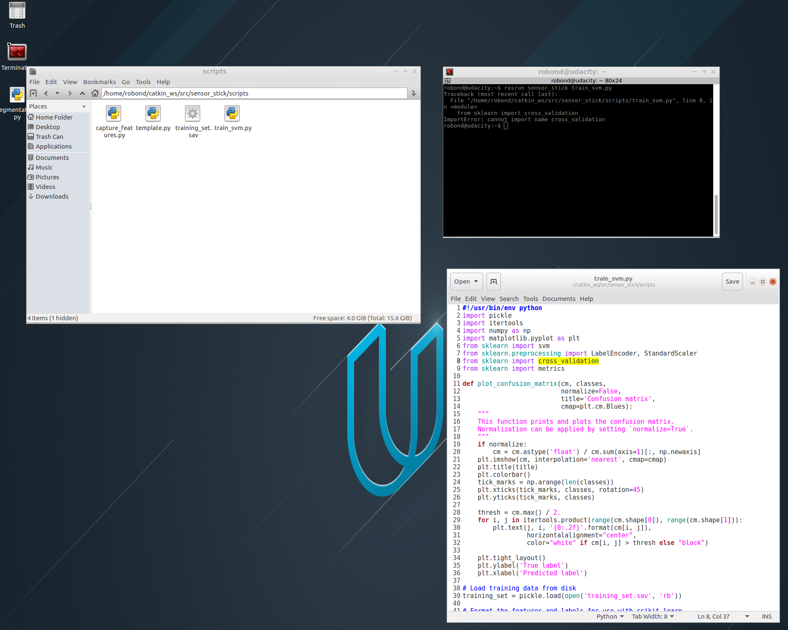

[](https://www.udacity.com/robotics)

## Udacity Project 3: 3D Perception in a Cluttered Space
##### Udacity Robotics Nanodegree
###### December 2018

# Currently stuck in rosrun sensor_stick train_svm.py

...
### Objective

###### To program a PR2 in identifying and acquiring target objects from a cluttered space and place them in a bin. The project is based on the 'Stow Task' portion of Amazon's Robotics Challenge.
###
###


##### Steps for this project:
    1. Setup Environment
    2. Set PR2 image its world2
    3. Identify objects from the pick lists
    4. Maneuver the PR2 towards the objects
    5. Grasp the objects
    6. Maneuver the PR2 towards the object's destination bin
    7. Successfully place the object in the bin

##### 1. Setup environment

We operate PR2 in a VM (Virtual Machine) created by Udacity for this project using **ROS Kinetic** (ran through Linux Ubuntu 16.0) and commands are written in **Python**.

The code driving this project and interacting with ROS can be found at `project_template.py`

*Quick note on naming convention:* `THIS_IS_A_CONSTANT` *and* `thisIsAVariable`

If you don't already have the directory made:
```sh
$ mkdir -p ~/catkin_ws/src
$ cd ~/catkin_ws/
$ catkin_make
```
Then, clone the project repo:
```sh
$ cd ~/catkin_ws/src
$ git clone https://github.com/udacity/RoboND-Perception-Project.git
```
Install missing dependencies:
```sh
$ cd ~/catkin_ws
$ rosdep install --from-paths src --ignore-src --rosdistro=kinetic -y
```
Build it:
```sh
$ cd ~/catkin_ws
$ catkin_make
```
Add the following to your `.bashrc` file:
```
export GAZEBO_MODEL_PATH=~/catkin_ws/src/RoboND-Perception-Project/pr2_robot/models:$GAZEBO_MODEL_PATH
```
And if it's not there already, also add this to `.bashrc`:
```
source ~/catkin_ws/devel/setup.bash
```

Currently stuck in Ros Run Error
