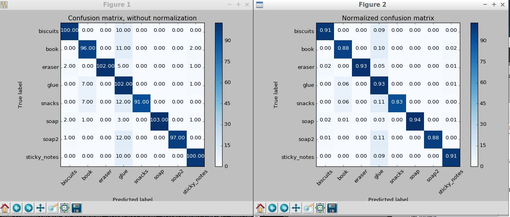

[](https://www.udacity.com/robotics)

# A.  Create a Catkin workspace

1. Download the VM provided by Udacity

2. Create a top level catkin workspace directory and a sub-directory named `src`
```
mkdir -p ~/catkin_ws/src
```
3. Navigate to the `src`
```
cd ~/catkin_ws/src
```
4. Initialize the catkin Workspace
```
catkin_init_workspace
```

5. Return to the top level directory
```
cd ~/catkin_ws
```
6.  Build the Workspace
```
catkin_make
```
For more information on the catkin build, go to [ROS wiki](http://wiki.ros.org/catkin/conceptual_overview)


# B. 3D Perception
Before starting any work on this project, please complete all steps for [Exercise 1, 2 and 3](https://github.com/udacity/RoboND-Perception-Exercises). At the end of Exercise-3 you have a pipeline that can identify points that belong to a specific object.

In this project, you must assimilate your work from previous exercises to successfully complete a tabletop pick and place operation using PR2.

The PR2 has been outfitted with an RGB-D sensor much like the one you used in previous exercises. This sensor however is a bit noisy, much like real sensors.

Given the cluttered tabletop scenario, you must implement a perception pipeline using your work from Exercises 1,2 and 3 to identify target objects from a so-called “Pick-List” in that particular order, pick up those objects and place them in corresponding dropboxes.

# C. Project Setup
For this setup, catkin_ws is the name of active ROS Workspace, if your workspace name is different, change the commands accordingly
If you do not have an active ROS workspace, you can create one by:

```sh
$ mkdir -p ~/catkin_ws/src
$ cd ~/catkin_ws/
$ catkin_make
```

Now that you have a workspace, clone or download this repo into the src directory of your workspace:
```sh
$ cd ~/catkin_ws/src
$ git clone https://github.com/udacity/RoboND-Perception-Project.git
```

Now install missing dependencies using rosdep install:
```sh
$ cd ~/catkin_ws
$ rosdep install --from-paths src --ignore-src --rosdistro=kinetic -y
```
Build the project:
```sh
$ cd ~/catkin_ws
$ catkin_make
```
Add following to your .bashrc file
```
export GAZEBO_MODEL_PATH=~/catkin_ws/src/RoboND-Perception-Project/pr2_robot/models:$GAZEBO_MODEL_PATH
```

If you haven’t already, following line can be added to your .bashrc to auto-source all new terminals
```
source ~/catkin_ws/devel/setup.bash
```

To run the demo:
```sh
$ cd ~/catkin_ws/src/RoboND-Perception-Project/pr2_robot/scripts
$ chmod u+x pr2_safe_spawner.sh
$ ./pr2_safe_spawner.sh
```


Once Gazebo is up and running, make sure you see following in the gazebo world:
- Robot

- Table arrangement

- Three target objects on the table

- Dropboxes on either sides of the robot


If any of these items are missing, please report as an issue on [the waffle board](https://waffle.io/udacity/robotics-nanodegree-issues).

In your RViz window, you should see the robot and a partial collision map displayed:


Proceed through the demo by pressing the ‘Next’ button on the RViz window when a prompt appears in your active terminal

The demo ends when the robot has successfully picked and placed all objects into respective dropboxes (though sometimes the robot gets excited and throws objects across the room!)

Close all active terminal windows using **ctrl+c** before restarting the demo.

You can launch the project scenario like this:
```sh
$ roslaunch pr2_robot pick_place_project.launch
```


#  Generate Features

In capturing the point cloud features, I used the sensor_stick model to analyze and record each object of the PR2 project. In order to do this, I copied the models folder from the PR2 project into the models folder of the sensor stick folder (PR2 models folder --> sensor strick models folder). Once the models were stored there, I copied the capture_features.py file to create a new capture_features2.py file and modified the new file for the objects.

With the file prepared, the next step is launching Gazebo environment.
```
roslaunch sensor_stick training.launch
```

Then run the capture_features2.py
```
rosrun sensor_stick capture_features2.py
```
This produces the file `training_set_pr2.sav` in the ~\catkin_ws folder.


#### Train Your SVM (Lesson 22.15)

Using capture attempts = 120 and histogram bins = 10, I was able to get over 90% (+/- 15) accuracy.





Run the train_svm.py
```
rosrun sensor_stick train.py
```
This produces the model.sav file located in the /home/robond/catkin_ws/model.sav.  Copy the model.sav file to ~catkin_ws/src/RoboND/pr2_robot/model.sav

Launch the pick place project.  Its best that you reboot the VM before issuing the command in the terminal
```
roslaunch pr2_robot pick_place_project.launch
```

Launch the object_recognition to produce the yaml files.
```
rosrun pr2_robot object_recognition3.py
```

Repeat and rinse :-) for the world 2 and world 3.


Thanks.
# Output
[Output 1](./primary_code/output_1.yaml)
[Output 2](./primary_code/output_2.yaml)
[Output 3](./primary_code/output_3.yaml)
